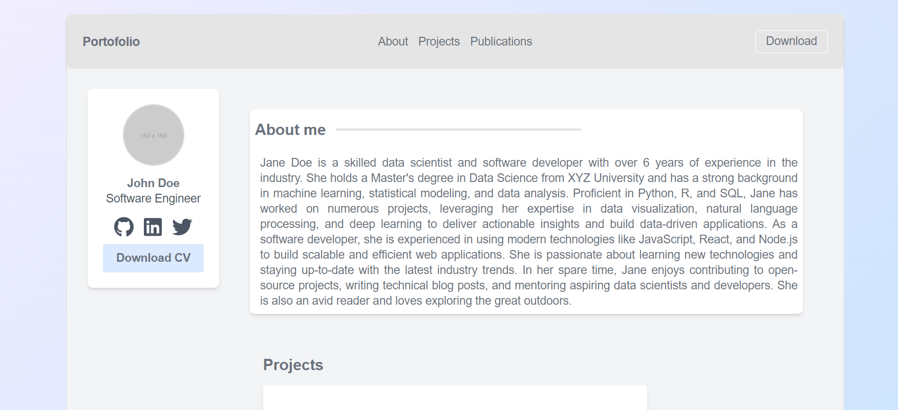

# Portofolio App

This is a portfolio app showcasing skills, experience, and projects. It's built using React and Tailwind CSS for a modern and responsive design.




## Features

- Responsive design for mobile and desktop
- About me section
- Projects list
- Publications list
- Downloadable CV
- Contact information

## Technologies

- 🟪 TypeScript
- ⚛️ React
- 🔷 Node.js
- 📦 Docker
- 🌊 Git


## Prerequisites

- Docker

## Getting Started

To get the project running locally, follow these steps:

1. Clone the repository:

   ```sh
   git clone https://github.com/yourusername/portfolio-app.git
   cd portfolio-app


## Setup
* Starting  from base_config branch
Run next commands:
```
docker-compose up -d --build
```

## Configuration

    |--app
    |--app/backend
    |--app/frontend

## Backend

## Setup 
After image is build and running
```
docker exec -it backend-app django-admin startproject backend
```
Once configured our project let's create our first django-app (users)
```
docker exec -it django-app bash 
cd app && python manage.py startapp users
```
Then apply migrations and create superuser
```
docker exec -it django-app bash 
cd app && python manage.py makemigrations 
python manage.py migrate
python manage.py cretesuperuser
```
## Setup 
* Starting from master or main/dev branch
Run next:
```
docker-compose build
docker-compose up -d
```
Create new django-app using:
```
docker exec -it django-app python manage.py migrate
```

## Tailwind

## References:

* [React vs. Vue (Exact Todo App) By Example](https://medium.com/js-dojo/react-vs-vue-exact-todo-app-comparison-by-example-14cc56efc5e5)
